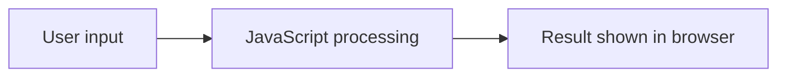

# 🩺 Medical Symptom Checker

<p align="center"></p>

<p align="center"><b>A lightweight browser-based symptom-checking interface built with HTML, CSS and JavaScript.</b></p>

<p align="center">  </p>

## 🌟 Overview
A small, easy-to-understand frontend project for entering symptoms and displaying the application's programmed response. It is useful for learning DOM events, form handling, styling and client-side logic.

## 📁 Structure
```text
Medical-Symptom-Checker/
├── index.html
├── stylr.css
└── script.js
```

## 🔄 Flow


## ▶️ Run
Open `index.html` directly, or use a local static server such as VS Code Live Server.

## ⚠️ Medical Disclaimer
**Educational/demo project only.** It is not a medical device or diagnostic service. Never use its output as a substitute for professional medical advice.

## 💡 Future Improvements
- Structured symptom/disease data
- Better validation and accessibility
- Responsive mobile UI
- Automated tests for decision rules

## 📄 License
No license is currently declared.